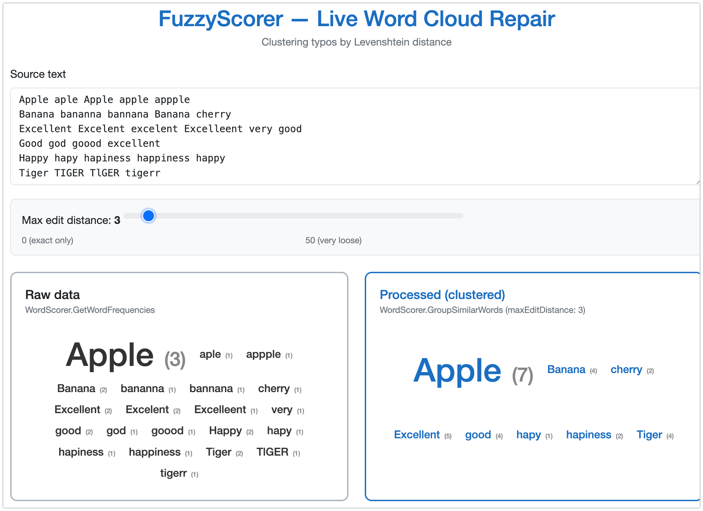

# FuzzyScorer.Demo

Blazor WebAssembly demo app showcasing the
[FuzzyScorer](https://www.nuget.org/packages/FuzzyScorer) NuGet package (v1.1.2) —
real-time word cloud clustering using Levenshtein distance typo correction.

Targets **.NET 10.0**.



## Run

```bash
dotnet run
```

Opens at `http://localhost:5231`.
